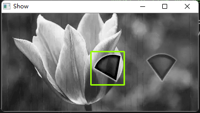

# tiny-captcha-solver
> A tiny simple out-of-the-box api for slide captcha and ocr captcha. using opencv and tesseract. self training tessdata. 一个简易的验证码识别服务，支持数字、字母的OCR以及滑动验证码的缺口识别。

## 运行环境 
* debian 9/ debian 10 /debian 11
* python 3.8+
* opencv 
* tesseract 4.0+

## 特性
* 滑块验证码的缺口位置识别  
* 简单数字或字母的OCR识别  
* 自训练数据集，增加对某些字体的识别成功率

## 服务器部署

```shell script
# 获取代码
git clone https://github.com/pkjy/tiny-captcha-solver.git

# 进入项目目录
cd tiny-captcha-solver

# 安装依赖
apt-get install -y tesseract-ocr python3-opencv
pip3 install -r requirements.txt -i https://mirrors.aliyun.com/pypi/simple/

# 拷贝识别的数据集
mkdir /tessdata
cp -r tessdata/* /

# 运行
python app.py
```
## Docker部署  
使用 Dockerfile 构建 或者直接 Pull镜像  
```shell script
# 获取代码
git clone https://github.com/pkjy/tiny-captcha-solver.git

# 进入项目目录
cd tiny-captcha-solver

# dockerfile 构建
docker build -t tiny-captcha-solver:latest .

# 运行镜像
docker run -p 5000:5000 --name tiny-captcha-solver -d tiny-captcha-solver:latest
```  

```shell script
# 从 dockerhub pull
docker pull pkjy/tiny-captcha-solver:latest
# 运行镜像
docker run -itd --rm -p 5000:5000 --name tiny-captcha-solver pkjy/tiny-captcha-solver:latest
```  


### use
#### send request in local, for slide.
```
POST 127.0.0.1:5000/slide/base64
content-type: application/json

# post data with body raw (json):
{
  target: base64 format for target image
  template: base64 format for full background image
}
```
will return target position `{x1,x2,y1,y2}` like
```
{
    "code": 0,
    "result": {
        "x1": "181",
        "x2": "249",
        "y1": "78",
        "y2": "146"
    }
}
```
raw input

  


result  




#### send request in local, for ocr.
raw input  


available arguments：
|name|arguments|note|
|-|-|-|
|type|pkjy.num、pkjy.alphabet_num|default is pkjy.alphabet_num. num is for pure number ocr. alphabet_num is for combination of alphabet and number |

```
POST 127.0.0.1:5000/ocr/base64
content-type: application/json

# post data with body raw (json):
{
  base64: [multi base64 format for target image] 
}
```
will return target position `{"code": 0,"result": ["47SS"]}` like
```
{
    "code": 0,
    "result": [
        "47SS"
    ]
}
```


### demo
base64 demo api：https://pkjy.xyz/captcha/ocr/base64 
here's the sample
``` bash
curl --location --request POST 'https://pkjy.xyz/captcha/ocr/base64' \
--header 'Content-Type: application/json' \
--data-raw '{"base64":[
  "/9j/4AAQSkZJRgABAgAAAQABAAD/2wBDAAgGBgcGBQgHBwcJCQgKDBQNDAsLDBkSEw8UHRofHh0aHBwgJC4nICIsIxwcKDcpLDAxNDQ0Hyc5PTgyPC4zNDL/2wBDAQkJCQwLDBgNDRgyIRwhMjIyMjIyMjIyMjIyMjIyMjIyMjIyMjIyMjIyMjIyMjIyMjIyMjIyMjIyMjIyMjIyMjL/wAARCAAeAHgDASIAAhEBAxEB/8QAHwAAAQUBAQEBAQEAAAAAAAAAAAECAwQFBgcICQoL/8QAtRAAAgEDAwIEAwUFBAQAAAF9AQIDAAQRBRIhMUEGE1FhByJxFDKBkaEII0KxwRVS0fAkM2JyggkKFhcYGRolJicoKSo0NTY3ODk6Q0RFRkdISUpTVFVWV1hZWmNkZWZnaGlqc3R1dnd4eXqDhIWGh4iJipKTlJWWl5iZmqKjpKWmp6ipqrKztLW2t7i5usLDxMXGx8jJytLT1NXW19jZ2uHi4+Tl5ufo6erx8vP09fb3+Pn6/8QAHwEAAwEBAQEBAQEBAQAAAAAAAAECAwQFBgcICQoL/8QAtREAAgECBAQDBAcFBAQAAQJ3AAECAxEEBSExBhJBUQdhcRMiMoEIFEKRobHBCSMzUvAVYnLRChYkNOEl8RcYGRomJygpKjU2Nzg5OkNERUZHSElKU1RVVldYWVpjZGVmZ2hpanN0dXZ3eHl6goOEhYaHiImKkpOUlZaXmJmaoqOkpaanqKmqsrO0tba3uLm6wsPExcbHyMnK0tPU1dbX2Nna4uPk5ebn6Onq8vP09fb3+Pn6/9oADAMBAAIRAxEAPwD0/R9Gg1OxvL66udXlnN/erti1a5jGEuZVVVVZFUYVQB0HFcN8OdZn8R+K9YzJqZt3UXOl211ql2gFuGaNm+84c52g5Jw2dvQ41PFesT6X8NJ7e2tpriTVNcvNPMcDASFHu5yyrlW+ZlUoOOC+e2DyMfiTxZF460qTQ/Bj6bdPpX9lWllqRcq8cR8wlXfy8kAAck/iSK+qoYKriMPXTekrpNySUVF3ej6PZ6aJPuctRJ6X/r7j01/CeoQRKY7m9mAbDK2tXjSbeOc+aik8njC8Ack1X1A6PY294DD4l+3QxM0Fo+rXoa5cA4VCsrdSMZ9+M131Vb/TrXU4FhvIvMjVt4G4jnBHY+5r5P2uLpvmp1W/KTdn81qjKeGqwV6E7vtLVf5r8fQ8MZ9fN/pup6trF/otnc6pbWcekRatPLI0bvl2mdpt0eEyp4ByOVTrXqJ0ayiaVjJr4V4sRRf2jftu5yGZgxKHI6DkAnPXA534laO1vF4ZSzupPLk160iS3nbzI0bDBSN2SB1yOQc+1baRXdm6wzxSWqsQFZRtDHpnETouT2Ub34PUAV05rmeKlSpTty3vte2jVtb3fe8tbnHWr16TUZR+fT7/APO3oM+xaZFzcTagp6eWviS7WQH3WSRMD/63GOaPJ0L/AJ7az/4Ucn/yTVqfU7+wQNFrdlfSsdvkzqsJT1yBgg/7xXGMYJIwT6qdgl1F9MvkU/NDbXgChepPltw59iTzjAHJrxnm2JV060k1/W6b/AxeNkrpzs13irffFy/C/nY4LxF4k8jW7jSvDmgeKdWFssTXFxFq9/8AL5i7htUM2Mgghm6kH5SBk9Tpp0nxDpkOqfbbzR7ucsLq0utVuVeOVD5bKVWdMYKEZIyRjIHSuM8RW7w+JZ/EnhOVUmnEYuNNvbWMwSBB/CcnGdqjoD8zHeM4ro/CvjWx13R/On0+DSLyKQwXKxSTRfOAMttjXkc8KzZHIz3Pt4zH0amCjiMNOLceVSlzzum1qnF7JyWjTs7JMbx9KcXJTjpbW7/Dtf19Tp/+EOb/AKCt7/4ML7/5Jo/4Q5v+gre/+DC+/wDkmqqXml3DqjeIL0OSAi2vnqWJ7HcXz7Yx+NFy1hFbvKuqa5OiP5cgct5an0k3JjHQEYJ56GvG/tWdr87/APBj/wAyvrtGzkrWX/Ty/wCpyWt+JfDGhawdMm1zVbiaJ9l09rdX7pa8qMuftI6FsHbuIIIIzxXU6Po1lr+lQ6npmuXs9nPu8uT7bqC7trFTw1wD1B7Vw9xFrnw98S6trulaPc6jol632y9iEcluYGBZsKwHKKXPJXBAOVGA1epaH4oh8RaNbarp2nXslpcAlGbylPBKkEF+xBH4V9Fi3COHhWw8puLsuZTk9bXcXFaxae2uq113Oui6c02728nJ/kzB8Q+G5NM8Narfpquoh7azmmXy9RvQ2VQngtOwB47gj2PSitrxbK83gHxEz28kBGm3I2yFST+6bn5SRRX0fC2FpYujUlW5pWateUu3qVVpR0cb/fL/ADGeGrKK50qd3ecEalfj93cOg/4/JuykCpdU8J2esz2E+oXNzPNYTi4tZCI1aJwQQQQgOMgZB4OBkHArzofFTQPD91qOj36a0ZLbUr0SLaLGI23XMrghtwfow6EdPzd/wufwM3MujatO3964hjlYD0y8pOPavmK+X4z6xOpRha7eqlyt39PLuaSim9I/i1f7t/mdvcKlrOtvDqk1024qyiaSSVDnncqzKTjn7q8Ac+tV72+j04Frm0OoR4BAujJEAc4+VJmYsfdRwD15rnE+PfhKNFRNN1hUUAKqwRAAeg/eVPa/HbwxeXkFtHYauHmkWNS0MWAScDP7z3rzamQYlRckkvudvvev3HHPALlbjJRfpe33tp/Neljav9HXWoLOUeF7AxwXMdzDIJB82AcOFBTI5+6xwcjI9GPpX9pqrGwmS38zLyW9vDEFUAcqAWaQHnkMRyMA4xXFP8XvBV87TX+i6kGYkmOGCIDPqXDhmJ59Bz0yM1Ym+N3hqKImxh8RJJ/dcxsG/F3fHfoOe/tjPJMbUgvapuC84/grJJP1v8zllg/aQ56rvD5ar0UUkvne3Zo7f+xNGi+a3ivA3l+WRNYyyI3qxG0EN7qRj882tO1K1sZY7Q3SQxjP7jAkCjk4BUKyY/iMi54PoTXm5+PVobORRb3azfdjzbIxx6lvMA3df4Me3pEnxk0O4Rf7Rm12RsDcIbeJB/ukebsZevVcn6cUoZTi4yTw9Kz36JW/8D/rqFOKjNPCws99rK1+vvX/AK1Or8VeDn1LWJNR0vx3qGiyXu2aW2gmLJKQiorRojqckJ/tZ4xjGK2tC0jSfC3hldJsbGaWwRi0k98qRB3Zs5kLBScfKMhTwABkjFcDB8YfCVs5MSeI0QjDRxw28aMO/CsMHtuGD70//hcXgkukkll4jkkjLFHeQbkz1APncccfQc5r161POq9BUJxSiunu9NFdq97Lv6He3iJp6JX/AK8/yXr1O5j0jUtQll2rDYWUitH5USyIpB6NsypZux3ADAHBqxLo2ladcOzXlks0oBKXsURXHTKqNuPqODzkE9OD/wCFzeAzy2gag7d2e0hZifUkyZJ9zViD46+DbVClvpOqwoTkrHbQqCfXiSvPhw9iF8VNX73v+GhlTy+mviSb73b+5aWILjwd4hmt7uwX4kXN7p8kTp5McJup3RhyrAN05I3E46dM8dP4W0eXQvDtto8d9qogiiZFjWzKuzsxYneUwmSx4ydvHznrWJ/wv7wr/wBA/Wf+/MX/AMco/wCF/eFf+gfrP/fmL/45XpV8HmdeHsp25b3aSjG77txab36387m/1XX4/uTX5P8AP53Oj8SRX8XgPxBEMxQR6bcf8fMStI+Y2LfMkmM9eSvfucmiuL8Q/G7w1q3hrVdNgsdWWa7s5oI2kijChnQqCcSE4yfSivtOEMHPC4epCfddb9CpU400oxbfqf/Z"
]}'
```

## notice
if you get src like `data:image/jpg;base64,UklGRkgJAABXRUJQVlA4WAoAAAAQAAAAQwAAQwAAQUxQS...` you need to remove header like `data:image/jpg;base64,` since it's Data URLs usage not base64 standard format.
