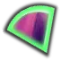

# TinyCaptchaSolver
> A tiny simple out-of-the-box api for slide captcha and ocr captcha. using opencv and tesseract. self training tessdata.

### Environment 
python 3.8

### demo
#### run
```bash
# Install dependency 
apt-get install -y tesseract-ocr python3-opencv
pip3 install -r requirements.txt -i https://mirrors.aliyun.com/pypi/simple/

# Run
python app.py
```
#### run(docker)
```bash
git clone https://github.com/pkjy/tiny_captcha_solver.git

cd tiny_captcha_solver

# 修改entrypoint.sh中的参数，具体参数往上翻，默认9898端口，同时开启ocr模块以及目标检测模块

# 编译镜像
docker build -t tiny_captcha_solver:v1 .

# 运行镜像
docker run -p 5000:5000 --name tiny_captcha_solver -d tiny_captcha_solver:v1
```

#### use
##### send request in local, for slide.
```
POST 127.0.0.1:5000/slide/base64
content-type: application/json

# post data with body raw (json):
{
  target: base64 format for target image
  template: base64 format for full background image
}
```
will return target position `{x1,x2,y1,y2}` like
```
{
    "code": 0,
    "result": {
        "x1": "181",
        "x2": "249",
        "y1": "78",
        "y2": "146"
    }
}
```
raw input




 result


##### send request in local, for ocr.
```
POST 127.0.0.1:5000/ocr/base64
content-type: application/json

# post data with body raw (json):
{
  base64: [multi base64 format for target image] 
}
```
will return target position `{"code": 0,"result": ["47SS"]}` like
```
{
    "code": 0,
    "result": [
        "47SS"
    ]
}
raw input


#### demo
demo url: https://pkjy.xyz/captcha .you can request here with your images

### notice
if you get src like `data:image/jpg;base64,UklGRkgJAABXRUJQVlA4WAoAAAAQAAAAQwAAQwAAQUxQS...` you need to remove header like `data:image/jpg;base64,` since it's Data URLs usage not base64 standard format.